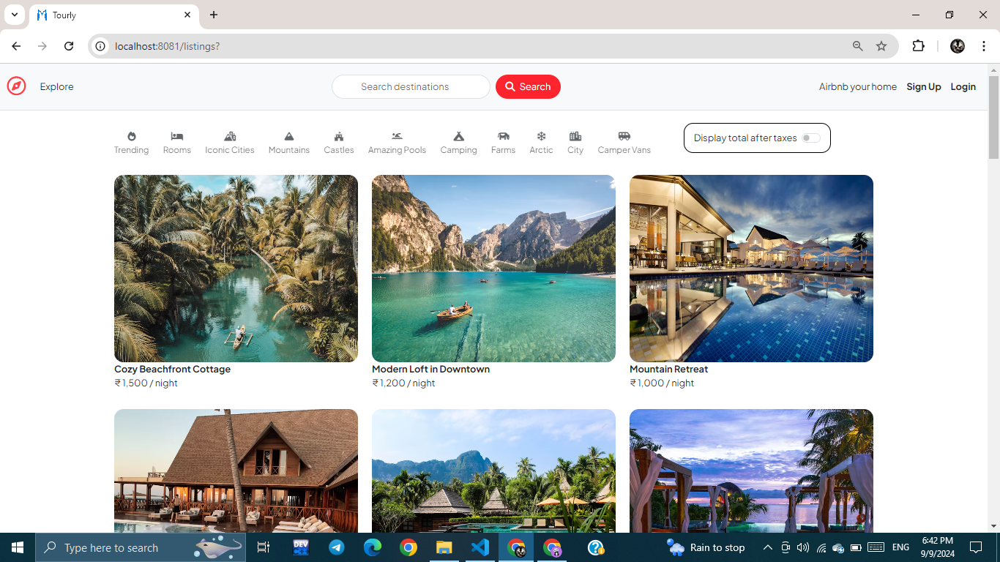
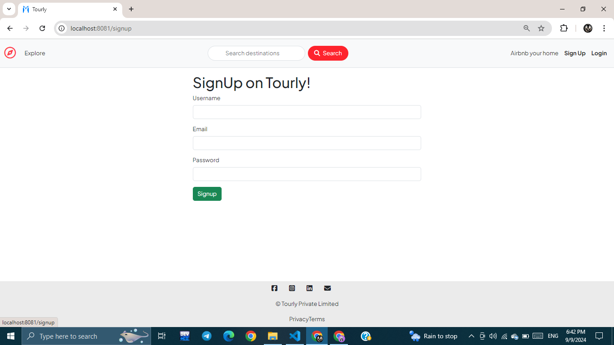
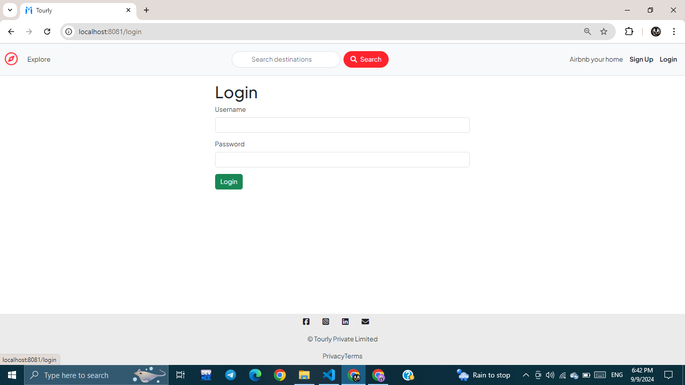
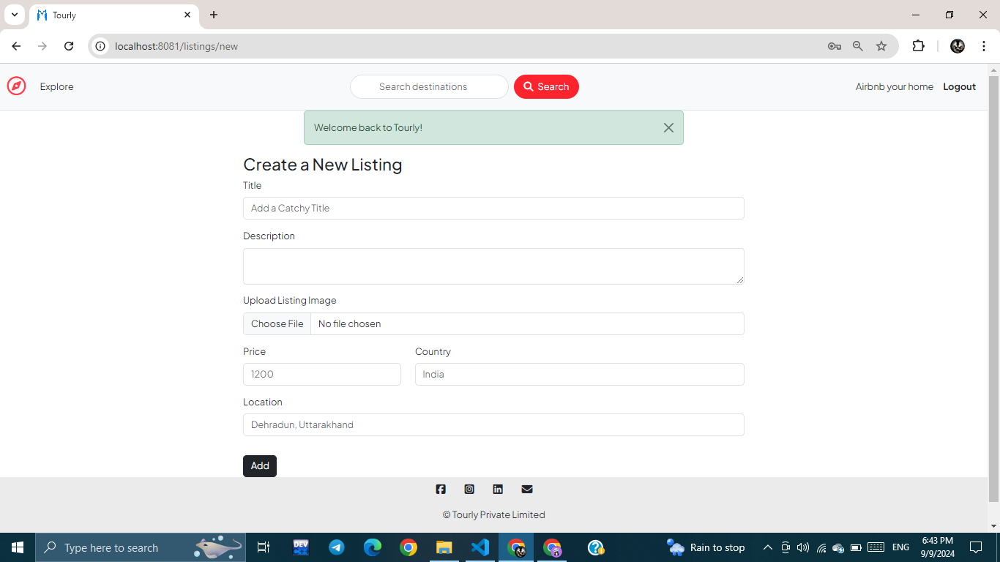
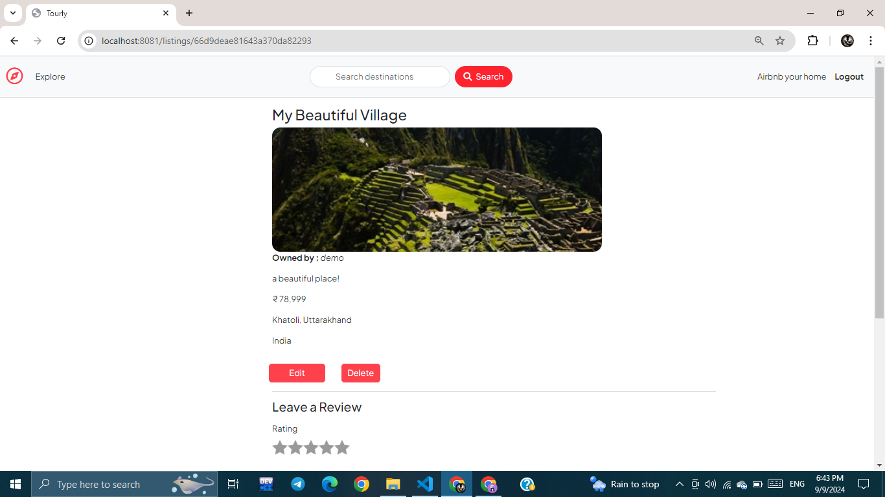
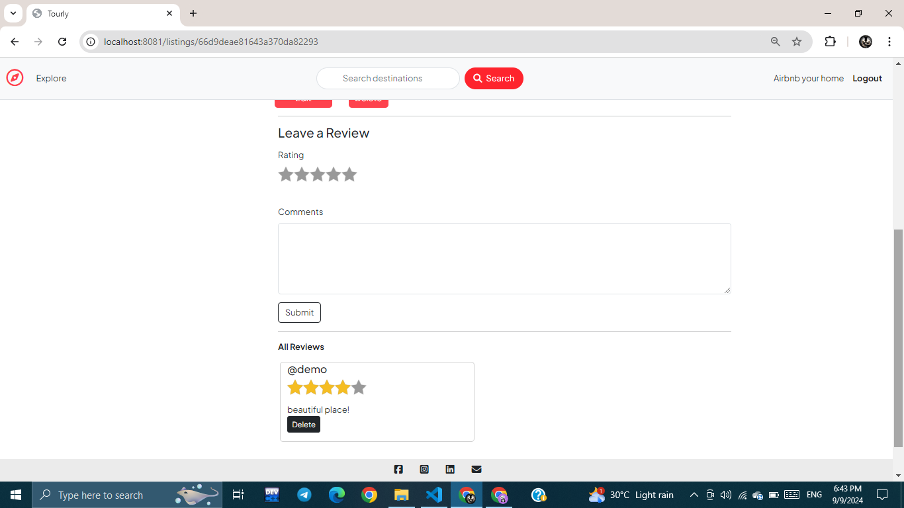

# Tourly: Your Ultimate Travel Companion

**Tourly** is a travel and tourism web application that simplifies your travel planning and enhances your travel experiences. Designed with modern web technologies and a robust backend, Tourly is your go-to platform for exploring destinations, planning trips, and sharing reviews.

This project is a web application that allows users to create, view, edit, and delete listings, as well as leave and manage reviews for these listings. It provides a marketplace-like platform where users can post items, and others can interact by leaving reviews and ratings.

## Features

- **Create New Listings:** Users can create a new listing by providing details such as the title, description, image, price, country, and location.
- **View Listings:** All listings are displayed with details, including an image, owner information, description, price, location, and country.
- **Edit Listings:** Only the owner of a listing can edit its details.
- **Delete Listings:** Listings can be deleted by their owner.
- **Leave Reviews:** Authenticated users can leave a review with a star rating and comment.
- **Manage Reviews:** Users can delete their own reviews.
- **Responsive Design:** Uses Bootstrap for responsive design, ensuring usability across various devices.
- **MVC Architecture**: Separation of concerns into Models, Views, and Controllers for maintainable and scalable code.


## Screenshots

### Home Page


### SignUp Page


### Login Page


### Create Listing


### Listing Details


### Leave a Review


> **Note:** Replace the paths (e.g., `screenshots/home_page.png`) with the actual paths where your screenshots are saved.

## Tech Stack

- **Frontend:** EJS templates, Bootstrap for styling.
- **Backend:** Node.js, Express.js.
- **Database:** MongoDB for storing listing and review data.
- **File Upload:** Uses `multer` middleware to handle image uploads.

## Prerequisites

Ensure you have the following software installed:

- **Node.js:** >= 14.x
- **npm:** >= 6.x
- **MongoDB:** A running MongoDB instance (local or cloud)
- **Git:** For version control

## Installation

1. **Clone the repository:**
   ```sh
   
   git clone https://github.com/ManoharSingh1311/Tourly
## Installation

Follow these steps to set up the project on your local machine:

### 1. Clone the Repository

Clone the repository to your local machine using Git:

```sh
git clone https://github.com/your-username/listing-app.git
cd listing-app
 ````

### 2. Install Node.js and npm
Make sure Node.js and npm (Node Package Manager) are installed on your machine:

````sh
node -v
npm -v
````
If not installed, download and install them from `Node.js` official website.

### 3. Install Project Dependencies
Install all the necessary dependencies:
```sh
npm install
````
### 4. Set Up Environment Variables
Create a `.env` file in the root directory to store your environment variables:
```sh
touch .env
````
Add the following lines to the .env file
```sh
MONGODB_URI=your_mongodb_connection_string
SECRET=your_secret_key
````
Replace `your_mongodb_connection_string` with your MongoDB connection URI and `your_secret_key` with a secure, random string.

### 5. Start MongoDB Server

Ensure your MongoDB server is running

- **MongoDB Atlas:** Make sure your cluster is active.
- **Local MongoDB server:** Start it with:

````sh
   mongod
````
### 6. Start the Application
Start the Node.js application:

```sh
npm start
````
The server should start on `http://localhost:3000.`

### 7. Open the Application
Open your browser and go to:
```sh
http://localhost:3000
````
### 8. Install Nodemon (Optional)
For development, install nodemon to automatically restart the server on changes:
```sh
npm install -g nodemon
nodemon
```
### 9. Verify Everything is Working
Test the application by creating, editing, and reviewing listings to ensure all features work correctly.

Troubleshooting
** MongoDB Connection Errors: ** Ensure your MongoDB server is running and the .env file has the correct connection string.
** Missing Dependencies: ** Check for any errors in the terminal and install missing dependencies.

## Contact Information:
For any inquiries, please contact me at :  burathimannu@gmail.com


